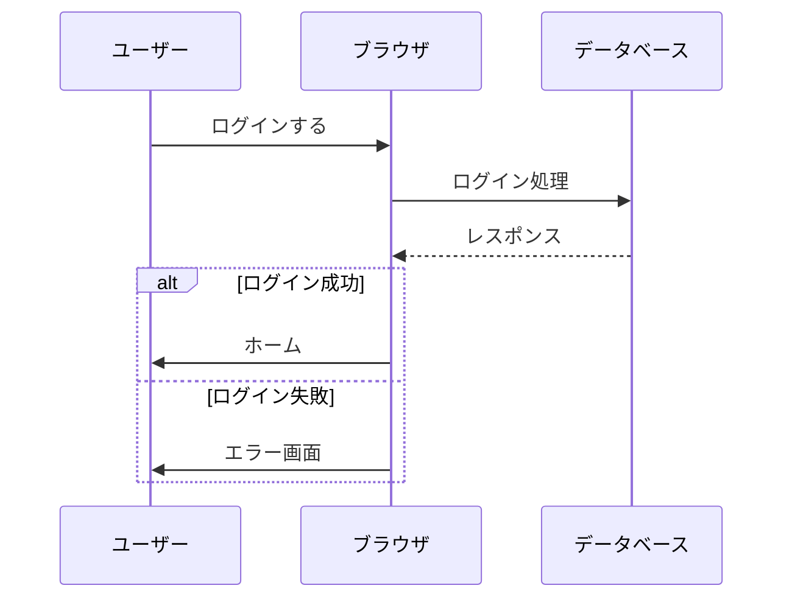

```mermaid
sequenceDiagram
    participant ユーザー
    participant ブラウザ
    participant データベース
    ユーザー->>ブラウザ:ログインする
    ブラウザ->>データベース:ログイン処理
    データベース-->>ブラウザ:レスポンス

    alt ログイン成功
        ブラウザ->>ユーザー:ホーム
    else　ログイン失敗
        ブラウザ->>ユーザー:エラー画面
    end
```

