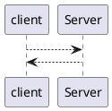

新しいテストドキュメント

テスト

<Danger>
  test
</Danger>

<Expandable title="Content">
  
</Expandable>

<Note>
  note

  noteだよ
</Note>



```plantuml
@startuml

client --> Server
Server --> client

@enduml
```

```marmaid
```