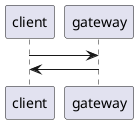
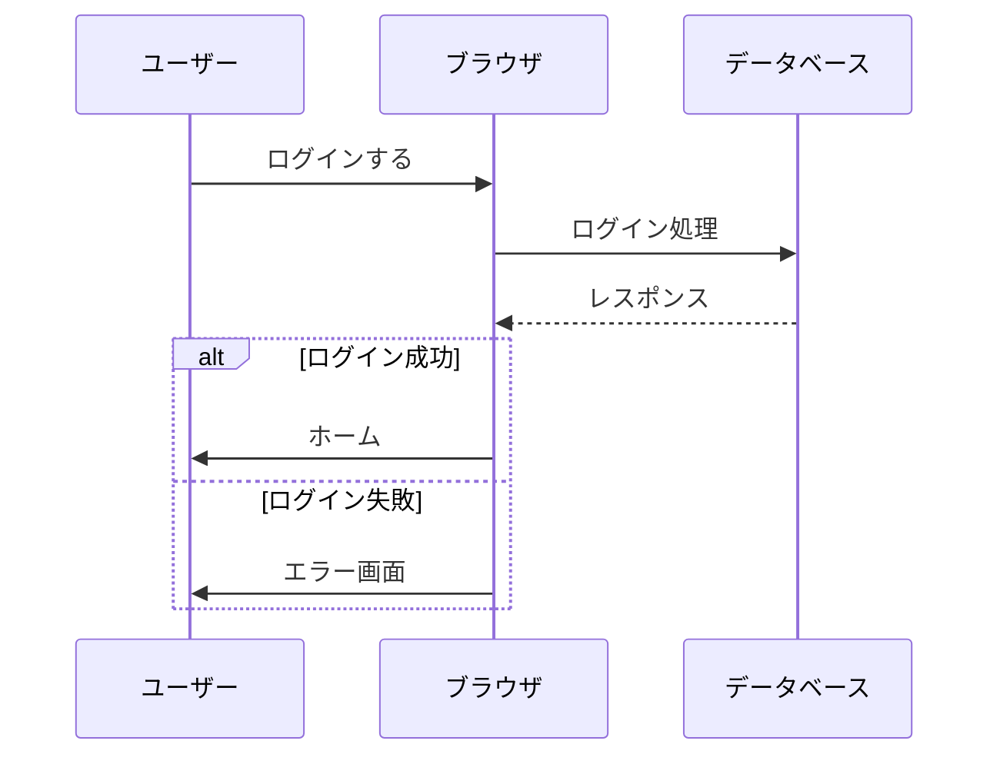

## test4 title

#### test image

test

```plantuml
@startuml
participant "client" as cli
participant "gateway" as gw
cli -> gw
gw -> cli
@enduml
```

```mermaid
sequenceDiagram
    participant ユーザー
    participant ブラウザ
    participant データベース
    ユーザー->>ブラウザ:ログインする
    ブラウザ->>データベース:ログイン処理
    データベース-->>ブラウザ:レスポンス

    alt ログイン成功
        ブラウザ->>ユーザー:ホーム
    else　ログイン失敗
        ブラウザ->>ユーザー:エラー画面
    end
```